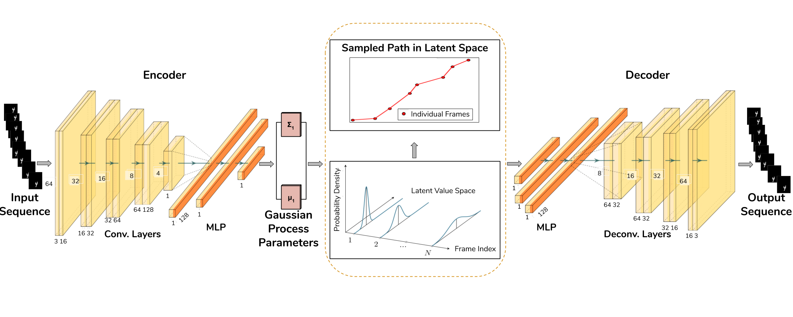

# Multi-disentangled-features Gaussian Processes Variational AutoEncoder (MGP-VAE)

[](https://paperswithcode.com/sota/video-prediction-on-moving-mnist?p=disentangling-representations-using-gaussian)
[](https://paperswithcode.com/sota/video-prediction-on-colored-dsprites?p=disentangling-representations-using-gaussian)
[](https://paperswithcode.com/sota/video-prediction-on-sprites?p=disentangling-representations-using-gaussian)

This repository contains code for the paper <a href="https://arxiv.org/abs/2001.02408">Disentangling Multiple Features in Video Sequences using Gaussian Processes in Variational Autoencoders</a>, accepted at the <i>16th European Conference on Computer Vision (ECCV 2020)</i>.

MGP-VAE is a variational autoencoder which uses Gaussian processes (GP) to model the latent space for the unsupervised learning of disentangled representations in video sequences. We establish a framework by which multiple features, static or dynamic, can be disentangled; specifically we use fractional Brownian motions (fBM) and Brownian bridges (BB) to enforce an inter-frame correlation structure in each independent channel, and show that varying this structure enables one to capture different factors of variation in the data. In addition, one can also improve learning by employing a novel geodesic loss function which takes into account the curvature of the data manifold. 



In case you find any of this useful, consider citing:

```
@inproceedings{Bhagat2020DisentanglingMF,
  title={Disentangling Multiple Features in Video Sequences using Gaussian Processes in Variational Autoencoders.},
  author={Sarthak Bhagat and Shagun Uppal and Zhuyun Yin and Nengli Lim},
  booktitle={European Conference on Computer Vision (ECCV)},
  year={2020}
}
```

## Installing Dependencies

In order to install all required libraries, clone our repository and run the following command.

```
pip install -r requirements.txt
```

## Preparing Data

In order to prepare data for the following datasets, follow any of these commands.

<b>Moving MNIST</b>
1. Download the prepared dataset from <a href="https://drive.google.com/file/d/1JAIpbRPqjbGyUltVbKnKYIxq8ig_aYfX/view?usp=sharing">this link</a>.
2. Prepare dataset manually by running script `./create_data/create_moving_mnist_data.py`.

<b> Colored dSprites</b>
1. Download the prepared dataset from <a href="https://drive.google.com/drive/folders/1rUyCR_fKfd1NnOJOKhEJlZWW4PIEh9Lw?usp=sharing">this link</a>.
2. Prepare dataset manually by running script `./create_data/create_dsprites_data.py` for the Train Set and `./create_data/create_dsprites_data_test.py` for the Test Set.

## Training

Begin training the <i>MGP-VAE</i> model by running the following command.

```
python train.py --is_training True
```

Customize the training by varying the following arguments, the details of which can be found in the `flags.py` script.

```
--num_dim              Dimension of Entire Latent Space
--num_fea              Total Number of Features
--fea                  GP Priors on the Latent Dimensions as a List 
                       (GPs must belong to the following set: {frac_0.1, frac_0.1, bb, bb2, ou}), details of which can be found in covariance_fns.py file.
--zero_mean_fea        Whether Latent Priors have Zero Mean or not (False indicating Zero Mean)
--mean_fea_s           Starting Mean of Each GP as a List (Valid only if zero_mean_fea == True)
--mean_fea_e           Ending Mean of Each GP as a List (Valid only if zero_mean_fea == True)
--beta                 KL-Divergence Weight in the Combined Loss Objective
```

## Evaluation

### Style Transfer

In order to evaluate the trained model using feature swapping, run the following command.

```
python style_transfer_across_videos.py
```

### Latent Visualization

In order to evaluation the trained model by plotting latent space visualizations, run the following command.

```
python videowise_visualization.py --num_points_visualization 6
```

NOTE: This code is valid only for models where the dimension of each GP channel is fixed as 2, i.e. `num_dim // num_fea == 2`.

## Geodesic Prediction 

Begin training the geodesic prediction model for the task of future frame prediction by running the following script.

```
python prediction_geodesic.py 
```

Customize training by varying the following arguments.
```
--max_geo_iter         Maximum Number of Iterations of Geodesic Update Step
--step_size            Step Size for Geodesic Update Step
--threshold            Threshold for Geodesic Energy for Termination of Updation
--num_epochs_geodesic  Number of Epochs for which Geodesic Prediction model is trained
```

## Contact
If you face any problem in running this code, you can contact us at {sarthak16189, shagun16088}@iiitd.ac.in.

## License
Copyright (c) 2020 Sarthak Bhagat, Shagun Uppal, Zhuyun Yin, Nengli Lim.

For license information, see LICENSE or http://mit-license.org
